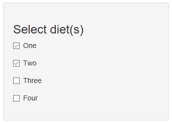

Developing Data Products - Week 4 Project
========================================================
author: 
date: September 23, 2018
autosize: true

Project Goals
========================================================

## As Instructed, The Project Is:
- Computationally simple
- A shiny application hosted on the RStudio shinyapps.io web site

## As Instructed, This Presentation Is:
- Produced with Rstudio Presenter
- Hosted on Rpubs

Application Features
========================================================
## Description Of The Underlying Data

- The ChickWeight dataset contains time series of weight measurements of chicks.
- The chicks were fed 4 different controlled diets to study the affects on weight over time. 

## Functionality Of The Application
- The application provides a convenient way to visualize the weight progression for each diet separately. 
- Comparison of the various diets may be performed by selecting the diets to be plotted. 

Example Use Of The Application
========================================================
The user can choose any number of the 4 diets from the data (1-4).  A graphical comparison is then provided on the right side.  

***

Thank You
========================================================
The application is published and publicly available at the URL:

<https://tpucke.shinyapps.io/Week4Project/>
